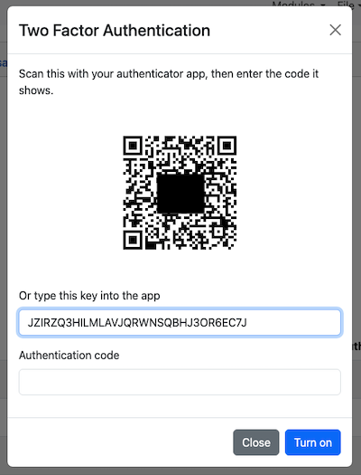

.. _user-profile:

Your Profile Menu
=================

.. contents::
 :local:

Every page in the server has a profile menu at the right hand end of the menu bar, shown
as a person icon.  It holds the settings that belong to you rather than to a survey or an
organisation, and it is where you sign out.

.. figure::  _images/userprofile.png
   :align:   center
   :alt:     The profile menu opened, showing User Profile, Change Password, API key and Logout

   The profile menu

Not every option appears on every page, and some depend on the security groups you belong
to, so your menu may be shorter than the list below.

My Tasks
--------

Shown on the pages that deal with tasks, with the number of tasks currently assigned to you
in brackets.  It takes you to your own task list.

.. _user-profile-details:

User Profile
------------

Opens a dialog holding your personal details.  Note that this one entry is labelled the
same as the menu itself, which is why it is easy to miss that the menu has other options.

You can set:

Name
  Your display name.  This is **not** the identifier you sign in with, which cannot be
  changed here.

Language
  The language of the server.  English, Spanish, French, Hindi, Arabic and Portuguese are
  available, with the first two being the most complete.  If you would like to help
  translate the server into another language, contact support.

Email
  Your email address.  You need this if you ever have to reset a forgotten password, so it
  is worth keeping current.

Organisation
  If you have been given access to more than one organisation you can switch between them
  here.  See :ref:`admin-users`.

Enterprise
  A higher level of compartmentalisation than an organisation.

Time Zone
  The time zone used when showing you data and when generating your reports.

Press **Save** to apply the changes.

Change Password
---------------

Opens a page where you set a new password.  You need your current password to do it.

Your server or organisation may set a minimum password strength, in which case a password
that is too easily guessed will be rejected.  See :ref:`password-strength`.

.. note::

  Changing your password signs out any web forms you had open using a saved link, and
  applies to FieldTask and the API as well, so a device will need the new password the next
  time it connects.

.. _user-profile-api-key:

API key
-------

Opens a dialog for managing the tokens that let a program sign in to the API as you, rather
than using your password.  See :ref:`apis` for what can be done with them.

You can hold more than one token at a time, which lets you give a separate one to each
program and withdraw one without disturbing the others.  For each token you give:

Name
  A label so you can tell later what the token was for.

Expires (days)
  How long the token should last.  Choose **Never** only where a fixed lifetime is genuinely
  impractical.

The list below shows the tokens you already have, when each was created, when it expires and
when it was last used, with a **Revoke** button against each.  Revoking takes effect
immediately.

.. warning::

  The token is displayed **once**, at the moment you create it.  The server keeps only a
  hash of it and cannot show it to you again.  Copy it straight away.  If it is lost, revoke
  it and create another.

.. _two-factor-authentication:

Two Factor Authentication
-------------------------

Two factor authentication asks for a code from your phone as well as your password, so that
somebody who has learned your password still cannot sign in.  It is optional and you turn it
on for yourself.

Smap uses standard time based one time passwords, so any of the usual authenticator apps
will work, including Google Authenticator, Microsoft Authenticator, Authy, 1Password,
Bitwarden, FreeOTP and Aegis.

Turning it on
+++++++++++++

#. Choose **Two Factor Authentication** from the profile menu.
#. Scan the QR code with your authenticator app.  If the phone cannot scan, type the key
   shown underneath it into the app by hand instead.
#. Enter the six digit code the app displays and press **Turn on**.

   Add two factor authentication

The entry the app creates is labelled with the name of the server, so if you use more than
one Smap server you can tell them apart.

Nothing changes until that code is accepted, so closing the dialog partway through leaves
your account exactly as it was.

Signing in from then on
+++++++++++++++++++++++

After you enter your username and password you are asked for a code.  Enter the six digit
code currently shown in your authenticator app.

The code is accepted once per browser session, so you are not asked again while you keep
working.  Closing the browser and returning means entering a new one.  Codes change every
thirty seconds and each one can only be used once.

If a code is rejected, check the clock on your phone.  Time based codes rely on the phone
and the server agreeing on the time, and a phone whose clock has drifted is the usual cause.
After several wrong attempts you are asked to wait a minute before trying again.

Turning it off
++++++++++++++

Choose **Two Factor Authentication** from the profile menu again, enter a current code and
press **Turn off**.  A code is required so that somebody who has got hold of an open session
cannot simply switch the protection off.

Once it is off you sign in with your password alone, until you choose to set it up again.

If you lose your phone
++++++++++++++++++++++

There are no recovery codes.  Ask an administrator to turn two factor authentication off for
your account, sign in with your password, and set it up again against your new phone.  See
:ref:`admin-security-two-factor`.

.. note::

  Two factor authentication protects the web console.  FieldTask and the API authenticate
  separately, with a password or a token, and are not affected by it.  Someone who has your
  password can still use those, so a password that may have been exposed should be changed
  rather than relied on being covered by the second factor.

Logout
------

Signs you out.

.. note::

  If you are using Firefox you will also need to close Firefox in order to complete the
  logout.
