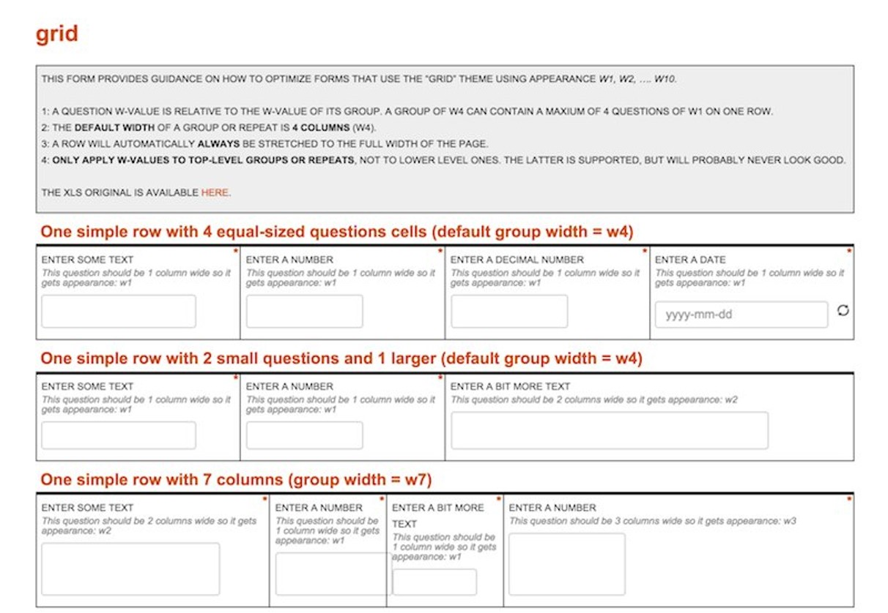
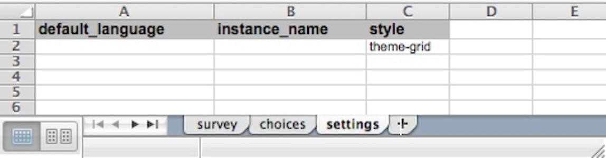
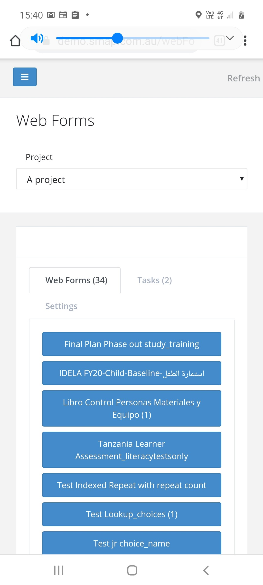
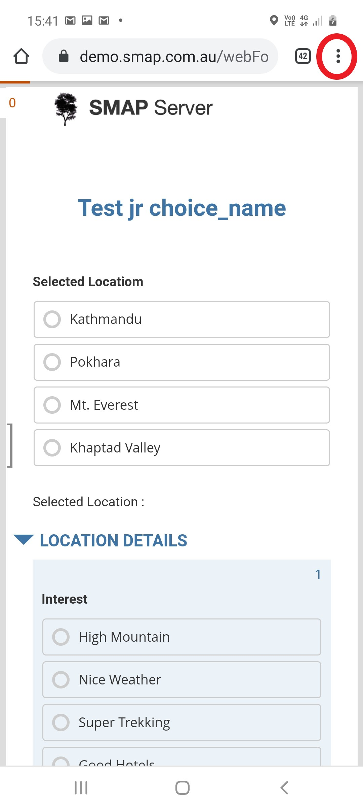
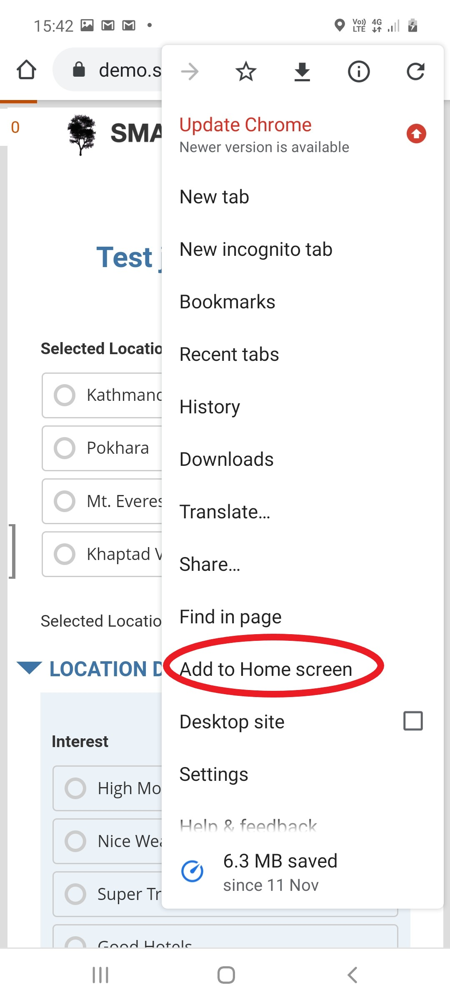
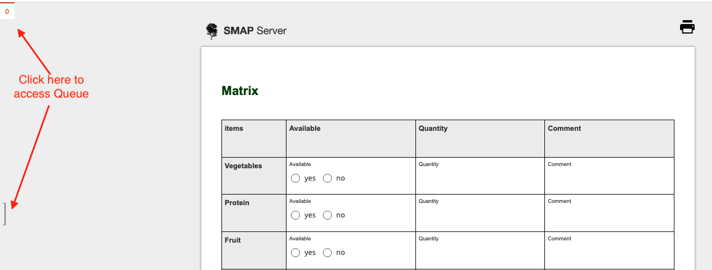
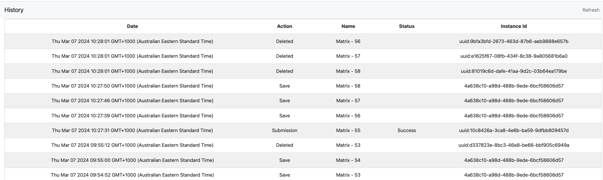

.. _webforms:

WebForms
==========

.. contents::
 :local:

Introduction
------------

Webforms allows you to complete surveys in a web browser.  The webforms launch page can be found by selecting the menu **modules** then
**webforms**. To access this page you will need the **enum** security group.  Smap's webforms uses the enketo-core library.

.. figure::  _images/webforms1.jpg
   :align:   center
   :width: 	 600px
   :alt:     Launching Webforms

   Launching Webforms
   
There are 3 tabs on this page.  The Web Forms tab itself which allows launching of a blank survey.  The tasks tab where tasks
can be selected for completion.  Finally a settings page where settings that can be changed by a user who only has **enum** privilege
can be updated by that user.

Styling the Survey
------------------

Grids
+++++

   Webform styled as a grid
   
To enable grids set **theme-grid** as the style in the XLSForm settings sheet.  Alternatively in the online editor
select menu **File**, then **Settings** then set style to **Grid**.

   Enabling Grids in XLSForm

Once grids are enabled you can use **groups** (begin group, end group) to form the questions into the grid you want.

*  Enclose the questions that you want to appear in a single row within a group
*  Set the width of the group using w1, w2, w3, w4, w5, w6 etc in the appearance column for that group. w4
   will set the width to 4.  These widths i the group appearance set a number for the width of the row.  When
   the widths of the questions exceed that number then the question will be shown on the next row.
*  Then set the width of each question in the group also using w1, w2 etc.  Normally you would make these widths
   add up to the group width.
   
`Example Grid WebForm (From Enketo) <https://drive.google.com/file/d/1ppkrE6jmi3AuftMEF9hIt7wZ9NydxIDB/view>`_

Pages
+++++

To enable pages set **pages** as the style in the XLSForm settings sheet.  Alternatively in the online editor
select menu **File**, then **Settings** then set style to **Pages**.

Once you have set the style to **pages** then every question will appear on its own page with a **next** and
a **back** button to navigate.  You can then use groups with the field-list appearance to put multiple questions on 
a single page in exactly the same way that you can do for fieldTask.

Styling Webforms Itself
-----------------------

Webform style options can be found on the users page in the "Webform Options" tab.  

.. figure::  _images/webforms4.jpg
   :align:   center
   :width: 	 600px
   :alt:     Webforms Styling Options

   Styling WebForms

.. note::

  If you have "organisational admin" privilege then you won't see the above tab instead you can change the webform style in the organisations
  tab by selecting the organisation that you want to modify.
  
The following properties can be changed:

*  The page background colour
*  The paper background colour
*  The position of the footer icon

Using a Webform offline on a mobile Device
------------------------------------------

Webforms works offline however you have to make sure that the form is cached on your device before you go into the field and that you 
can access it. The following instructions assume that you are using Chrome as your browser however Firefox, Safari and other browsers are similar.

1. Logon to the Smap server.  If you are using an account that has enumerator access then you should see the WebForms launch page.

   Webforms Launch Page

2. Select the survey that you want to open

This will show the survey form in your browser. At this point all the files associated with the survey will have been downloaded and cached in your browser so
that it can be used offline. Next you want to get a link to the survey so you don't need to navigate to the server to find it.

Select the menu for the browser so you can save a link to the survey locally. This menu may appear as 3 vertical dots (shown highlighted
in the next picture with a red circle).  However it may appear differently depending on the device.

   Selecting the browser menu from a survey

3.  From the browser menu select "Add to home screen"

   The browser menu extended

4.  An icon for the survey will be saved to your home page

   Survey icon on a device's home page

Managing Submissions
--------------------

Completed surveys are sent immediately, however if there is no network connection they will be put into a queue to be sent
later.  You may also save a survey as "draft" which will also put it into the queue until you complete it.  To access the
queue click on the count of unsent records at top left or the "drawer" icon at left.

   Accessing the webform queue

Once you have opened the drawer you can:

#.  View the history of work in webforms
#.  Select a draft survey to edit it
#.  OPen a draft survey for editing

WebForms History
++++++++++++++++

   WebForms History

The history page shows the surveys that have been completed and submitted over the last 100 days.
The action can be Submitted, Saved or Deleted. The instanceId is useful for connecting a Submission entry
in the History to a record in the Console of the server.

Note the webform history is not stored on the server, so if you are reconciling somebody’s work you will
have to ask them to talk through what they see in their history.

