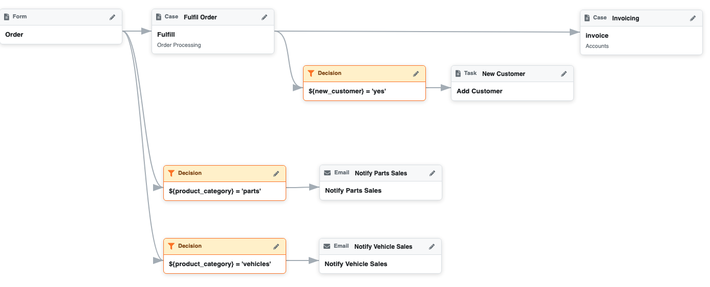
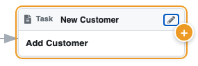
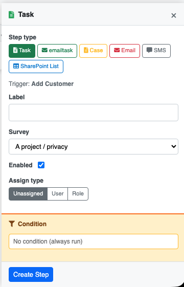

.. _workflow:

Workflow
========

.. contents::
 :local:

Workflow is the umbrella for both :ref:`tasks` and :ref:`notifications`. Using the Workflow page you can
create and manage tasks and notifications from a single place. If you have already set up tasks or
notifications they will be displayed diagrammatically on the Workflow page, showing the connections
between each triggering event and the task or notification it produces.

To access select **WorkFlow** in the modules menu on any page
Diagram
-------

The diagram shows your current workflow as a visual map. Each triggering event (such as a survey
submission, a periodic timer, a server calculation change, or a case management alert) is shown on
the left, with arrows connecting it to the tasks and notifications it triggers on the right.

This gives you an at-a-glance picture of how data collection events drive actions across your
program, making it easy to:

*  Identify which surveys or events are driving which tasks and notifications.
*  Spot gaps — events that collect data but do not yet trigger any follow-up action.
*  Detect duplication — multiple tasks or notifications triggered by the same event.

The diagram below shows an order processing workflow implemented in Smap. Note each step can be a case, task or notification such as
an email.  Hence in the diagram "Fulfil Order" is a case and is managed through multiple internal steps and then passed on to "Invoicing".
"New Customer" is a task. It is just one of the tasks of the "Fulfil Order" case.

   An order processing workflow

Starting a Workflow
-------------------

Click on the + symbol, inside a blue circle at the bottom right of the screen, to add a starting point for your workflow.

Adding a Workflow Step
----------------------

Select the workflow item that triggers the new item. Click on the **Add(+)** icon to create a step.

   Adding a new step

   Editing the step

For the Workflow step type, you can select:

*  **Task** — assign a survey to a user or group to collect or update data. See :ref:`tasks`.
*  **EmailTask** - Email a task to somebody who does not need an account on the system
*  **Case** - Assign a case to somebody
*  **Email** — send an automated email. See :ref:`notifications`.
*  **SharePoint List** - Push data into a SharePoint list.

Specify a label for the Workflow step so that it is meaningful to readers.  Specify other attributes of the Step, the exact
attributes depend on the step type.

Specify a condition of the workflow step is not always invoked.  These conditions use the syntax for :ref:`server-expressions`.

Editing, Deleting and Advanced Settings
---------------------------------------

Click any item in the diagram, then click on the pencil icon, to edit or delete it. Changes take effect immediately and the diagram
refreshes to reflect the updated workflow.  To the edit panel will also include a link to the underlying task or notification so that
advanced options can be set.

Simplification
--------------

The workflow page presents a simplified view of notifications and tasks.  You can access all the options by selecting "Advanced"
when editing a workflow item.  There are also some capabilities that are not currently accessible from the Workflow page; for example
to add a periodic notification you will need to go directly to the notification page.

Related Pages
-------------

*  :ref:`tasks` — full documentation on creating and managing task groups.
*  :ref:`notifications` — full documentation on triggers, targets, and notification settings.
