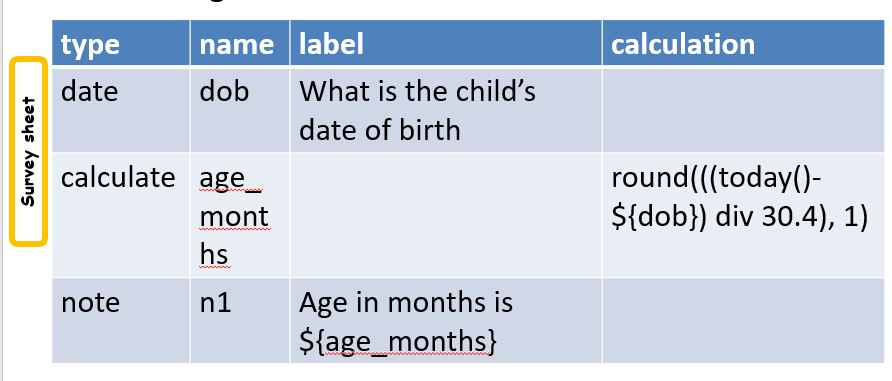
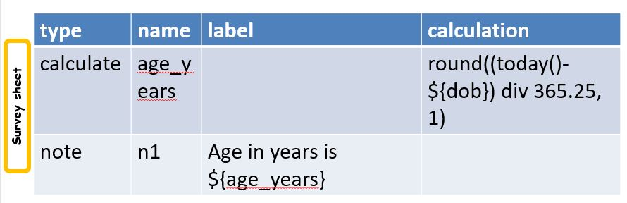
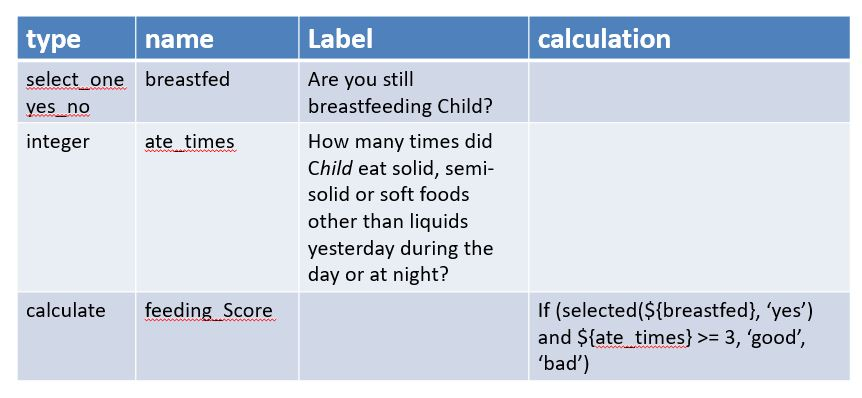

Calculations
============

.. contents::
 :local:
 
Introduction
------------

Sometimes you need to calculate a value and its handy to store that somewhere

* For use in a **relevance** or **constraint**
* To show the enumerator a derived value
* Sometimes you may just want a calculated value to use in your analysis and doing the calculation on the phone is
  just a good place to get this done
  
You need to::

  Specify the question type as "calculate"
  Provide a unique name
  Specify the calculation in the calculation column
  
Calculations use :ref:`expression-reference` extensively and you should familiarise yourself with the reference material if you 
are going to use them.
  
Example - Age in Months from date of birth
------------------------------------------
  
The expression to put in the calculation column is::

  round(((today()-${dob}) div 30.4), 1)

Breaking this down:

*  All dates store their answers as a count of days since the 1st of January 1970.  
*  The today() function returns the current date.

Hence if we substract the answer to the **dob** question from todays date we get the number of days since the 
child was born. 

*  We put (today()-${dob}) in brackets because we want it calculated first.  Then we divide by 30.4.  This 
   converts the number of days into roughly the number of months.  Not calendar months but in many cases the
   more useful value of a number of months.
   
This gives us the child age in months but if we display this to the user it is likely to have a large number
of digits after the decimal place.  So to pretty this up we use the round() function.

*  The round function takes 2 parameters.  round(value, number of places).  In our example we have specified the number
   of places after the decimal point as 1.
  
We could then show the calculation to the enumerator or use it in arelevance such as::

  ${age_months} < 60

   
   Age in Months Calculation
   
Example - Age in Years from date of birth
-----------------------------------------

   
   Age in Years Calculation
   
The if() function
-----------------

One function deserves special mention because it is so useful.  We may want to convert the answers to a 
number of questions into a simple score that we can use in relevance to determine further questions or to
determine services that should be provided.

For example the requirement might be::

  If a child is still breast feeding and the child eats solids more than 3 times per day then the feeding 
  score is "good" else it is "bad".
  
The implementation with an if() function would then look like this::

  if(condition, true response, false response)
  
  The condition is:  selected(${breastfed}, 'yes') and ${ate_Times} >= 3
  
  If this is true we want the calculation result to be "good"
  However if it is false then we want the calculation result to be "bad"
  
Putting it all together results in the following calculation

   
   If() Calculation
   
Nested if() functions
---------------------

Often we will want to nest if() functions one inside the other in order to generate a scale.

It looks like this::

  if(condition1, value1, if(condition2, value2, value3))
  
  So if condition1 is true the answer for the calculate will be value1. 
  Otherwise we move on to the next if() function
  if condition2 is then true the answer will be value2
  Otherwise the answer will be value3
  
Hunger Scale example
--------------------

To get the data we ask three questions of type **select_one**

*  Question (a) In the past four weeks was there ever a time when there was no food to eat of any kind in your household 
   because of lack of resources to get food?
*  Question (b) In the past four weeks, did you or any household member go to sleep at night hungry because there 
   was not enough food?
*  Question (c) In the past four weeks, did you or any household member go a whole day and night without 
   eating anything because there was not enough food?
	
The answer to each of these questions is a number between 0 and 2

0.  rarely (once or twice in the past four weeks)
1.  sometimes (three to ten times in the past four weeks) 
2.  often (more than ten times in the past four weeks)

We are going to add all of these up and if the total is

*  0 - 1 then the answer is "little to no hunger"
*  2 - 3 "moderate household hunger"
*  4 - 6 "severe household hunger"

To make the calculation easier to read we can do it in 2 stages. First we calculate the total (hunger_score)
and then we convert that into the hunger scale as shown below:

.. figure::  _images/calculations4.jpg
   :align:   center
   :width:   500px
   :alt:     Hunger Score Calculation
   
   Hunger Score Calculation
   
Dynamic Text Calculation
------------------------

Text functions can be used to dynamicly create guidance text that includes formatting::

  calculate hunger_msg  concat('The hunger scale is ', ${hunger_scale}, '')  

.. _trigger-calculation:

Triggering the Calculation 
--------------------------

Requires Smap Server 21.01 or above.

By default calculations are triggered whenever any of the questions that they refer to change. They are also 
re-calculated when the survey is saved.  You can use the once() function to change this behaviour and only
calculate the value a single time. Also you can use the default() function wrapped around the calculation to prevent
it from being re-calculated on save of the survey.

You can also specify a specific question that will trigger the calculation when it changes. This way you can 
update the value of a calculation by answering a question that does not appear in the actual calculation.

This approach works like using the default() option in that the calculation will not be re-evaluated on save and hence
any updates the user has made will be preserved.

.. rubric:: XLSForm that calculates the time at which a question answer was changed

.. csv-table:: survey
  :header: type, name, label, calculation, trigger
  
  text, name, Name,
  dateTime, name_entered_time, Started section at:, now(), ${name}

