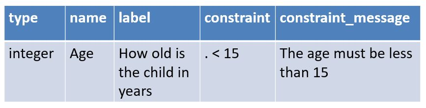
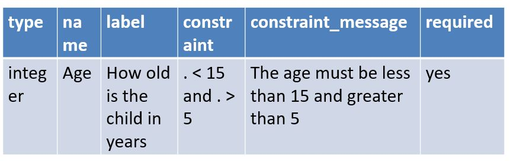

Constraint
==========

.. contents::
 :local:  

About Constraints:

*  Constraints are used to prevent the enumerator continuing if an invalid answer has been entered
*  Constraints are checked after the enumerator has finished answering a question and as they are moving onto the next question
*  A constraint always needs in some way to refer to the answer of the current question as its checking if that answer is valid
*  You refer to the answer of the current question using a "." (a dot)
*  This behaviour differs from **relevance** where rules are checked before a question is asked. Hence a relevance should never refer 
   to the value of its own question

.. figure::  _images/constraint1.jpg
   :align:   center
   :alt: Constraint on age which must be less than 15

   The age must be less than 15

.. note::

  In the constraint you specify what the answer must be. Hence in the preceeding example an error message wiil be shown if the age is greater
  than or equal to 15.

Constraint Message
------------------

If a constraint is violated the default error message is not vey helpful::

  Sorry, this response is invalid
  
The message will also be in the language of the phone and not necessarily the language of the survey.  You can provide an
alternative message in the **constraint_message** column.

   Constraint Message
   
If your survey has multiple languages and you want to show a different constraint message for each language then replicate the constraint_message
column for each language and change the headers to include the language name::

  constraint_message::german
  constraint_message::kiswahili

Making the Question Required
----------------------------

Probably the most important constraint that you can add is to specify that they question must be answered

*  It is quite easy when swiping between questions to go past a question without answering it, unless the question is **required**
*  If you don't answer questions then whole blocks of other questions might not show up due to the relevance not being satisfied

To make a question required::

  Add "yes" to the "required" column
  Optionally add your own message in the "required_message" column
  

   Required

Dynamic Required
++++++++++++++++

The question can be made required only if a condition is satisfied.  To do this specify an expression in the required column.

.. csv-table:: Survey Worksheet
  :header: type, name, label, required, required_message

  select_one yes_no, required_q, should the next question be mandatory?
  text, situation, Describe the situation, ${required_q} = 'yes', You must answer

This works for both FieldTask and WebForms.

Making the Question Read Only
-----------------------------

Often, instead of making a text question read only, the note type is used which has the same effect.  However you
can make other question types read only by specifying "yes" in the readonly column.

Dynamic Read Only
+++++++++++++++++

The question can be made read only, only if a condition is satisfied.  To do this specify an expression in the readonly column.

.. csv-table:: Survey Worksheet
  :header: type, name, label, readonly, default

  select_one yes_no, changed, Has the address changed?
  text, address, Address, ${changed} = 'yes', Fleet Street

This only works for both FieldTask and not WebForms.

Complex constraints on multiple Questions
-----------------------------------------

Its good to validate a question when the user answers it but sometimes you may want to take into account later questions.

You can add a constraint that forces the user to go back and fix up earlier questions, to do this create a

*  read only question of type “note”
*  make it mandatory!!!  The user will not be able to get past it.
*  make the question **relevant** only if there is a problem with answers to previous questions
*  in the label specify instructions to the data collector on how to resolve the issue

Refer to the example survey “constraint trick question.xls”

  
