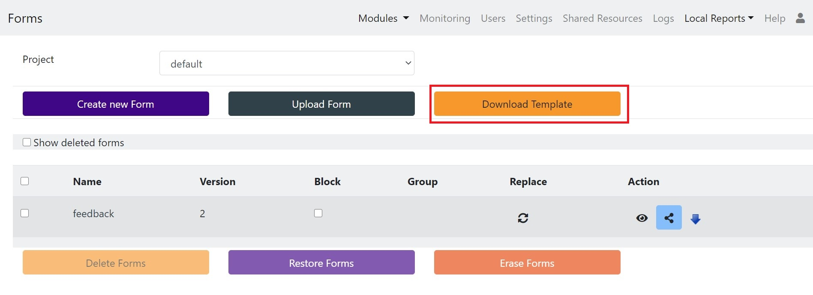

Getting the template
====================

Get the XLS template from the server.  

1. In your web browser enter the address of your Smap server.
2. Click on the login menu, this will take you to the Survey Management page.
3. Click on the button marked "Download Template" and the excel template will be downloaded to your computer.

   Downloading the XLS Template

The template will be called blankform.xls.

