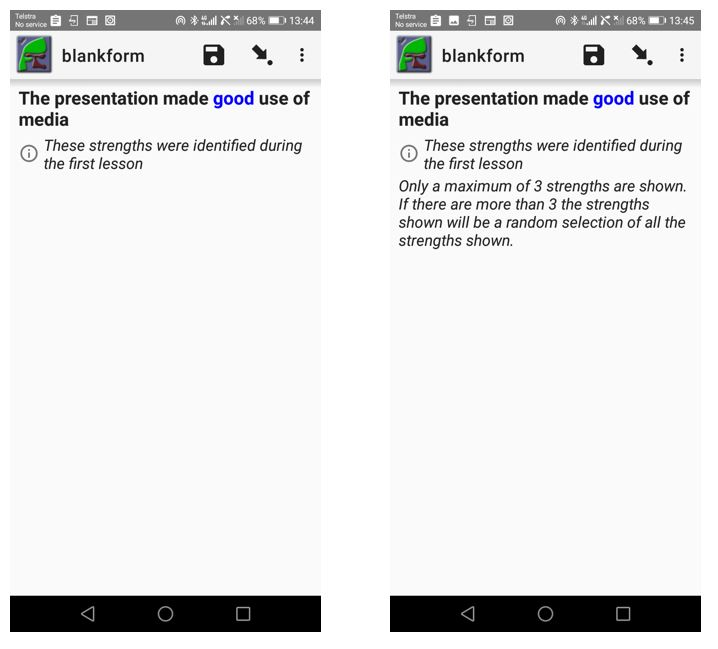

Guiding the data collector
==========================

.. contents::
 :local:  

There are two columns that you can use to add text that makes the data collector's job easier. These are **hint** and 
**guidance_hint**.

Hints
-----

Text placed in the **hint** column will be shown beneath the question text in an italic font.  This is intended to be used
as a help for the data collector in how to ask the question.

These basic hints are always included when a question is shown on the screen and the data collector will probably find them less 
useful as they become familiar with the survey. Hence you 
probably want to keep them quite short so that they don't take up too much screen space and are not a distraction 
from the question.

Guidance
--------

Longer help can be placed in the **guidance_hint** column.  The phone user can then control when they see the 
guidance.  They do this in FieldTask by selecting **menu** then **General Settings** then **Form Management**.  Then under 
"Show guidance for questions" they can select one of:

*  No
*  Yes - always shown
*  Yes - collapsed

The following picture shows the use of "Yes - collapsed".  On the left hand phone the guidance has not been expanded, on 
the right hand phone it has been expanded.

   
   Showing collapsed and expanded guidance 

Multi Language
--------------

Both **hint** and **guidance** can be specified in multiple languages. If you specify one column in multiple :ref:`languages` then the other must
also use the same languages. 
