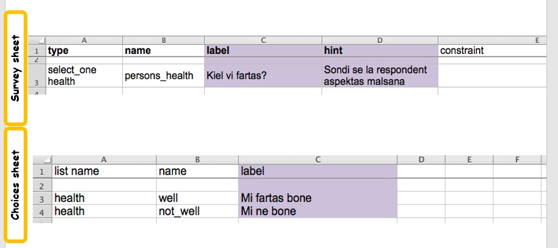
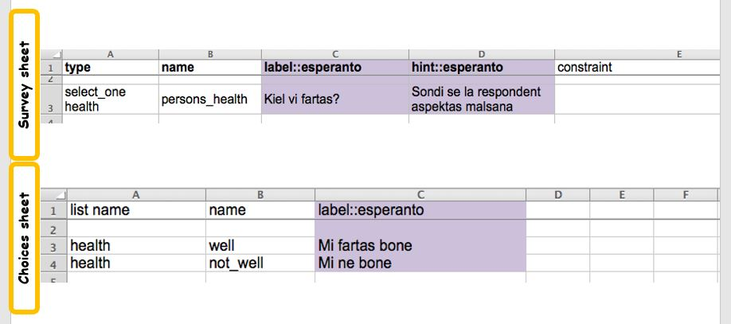
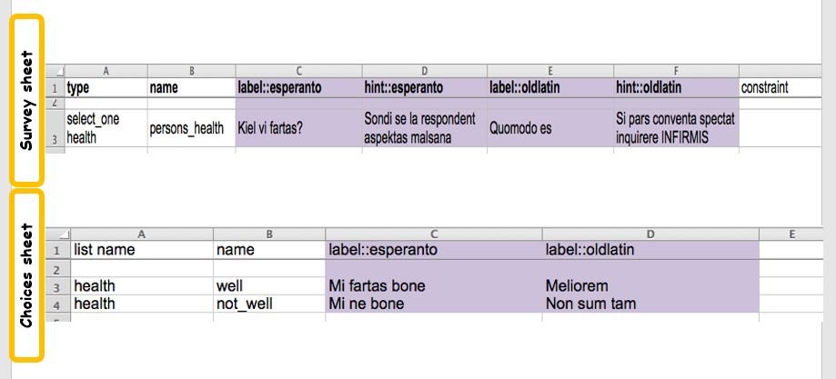

.. _languages:

Languages
=========

.. contents::
 :local:

Surveys can contain translations into multiple languages.  You can specify languages for the following columns

*  **survey label** (required for multi-language)
*  **survey hint** (required for multi-language)
*  **choices label** (required for multi-language)
*  survey guidance_hint
*  survey constraint_message
*  survey required_message
*  survey media::image
*  survey media::audio
*  survey media::video 
*  choices media::image
*  choices media::audio
*  choices media::video 

If you specify multiple languages for any of the first 3 columns then you will need to specify the languages for all of those first 3. The remaining
columns are completely optional and most often, even when you have multiple languages in your survey, you will not need to specify a value per language
for them.

Single Languages
----------------

   
   Single Language

You can write the labels for a survey in any language that is supported by your devices and your laptop. It is not necessary
to identify the language if there is only one.  In the diagram above the survey has been typed in Esperanto.  The principle 
columns where you will enter language specific text are the:

*  label column in the survey sheet
*  hint column in the survey sheet
*  label column in the choices sheet

Identifying the Language
------------------------

You can label the language by adding its name to the column heading (label / hint) with a \:\: separator. In the following
diagram the language has been labelled as being esperanto.  

   
   Labelled Language
   
This is not really useful.  The only point of labelling a language is so that the data collector can choose the language
that they want to use.  This is only necessary if there is more than one.  In the xls template the default language is specified 
as "language".  There is no need to change this name unless you are going to have more than one language.

Multiple Languages
------------------

   
   Multiple Language

Now there are two languages each with their own label.

You can give the language any name you like. For example oldlatin. 
As long as there are no spaces and you are consistent for all three columns.

Right to Left Languages
-----------------------

If you include **(rtl)** in the language name then it will be set right to left automatically::

  label::language(rtl)
  
Also if you include the following language codes the direction will be set Right to Left::

  label::arabic
  label::lanugage(ar)
  label::language(he)
  label::language(ur)
  
To force the direction as Left to Right even when the language is arabic then include (ltr) in the language name::

  label::language(ltr)
  

Optional Language Columns
-------------------------

*  survey guidance_hint
*  survey constraint_message
*  survey required_message
*  survey media::image
*  survey media::audio
*  survey media::video 
*  choices media::image
*  choices media::audio
*  choices media::video 

These can be added in the same way as the required language columns.   Copy the column and add the language identifier for each. 

.. note:

  If you use the guidance_hint column then it will need to have the same languages specified as the hint column.  The
  other optional columns do not need to have a language specified in which case they will apply for all languages.

However these are used less often with multiple languages.  Often in data collection there will be a single language that the enumerator will understand.  guidance_hint, 
constraint_msg and required_message can all be simply put in this one language as the contents are not generally 
read out to the interviewee.  Also the required_message is rarely used as the default usually suffices.

It is also true of the media columns that they are often not required to be set in multiple languages.  Certainly if you are using images you may 
be able to ensure that your pictures are language
independent.  With Audio and Video there would presumably be a language dependence however this is only required if there is more than 
one language used among the people being interviewed.  For many surveys where multiple languages are used there are two languages
one for the analysts and the second the interviewees.  In these cases only audio in the interviewee language would be required.
