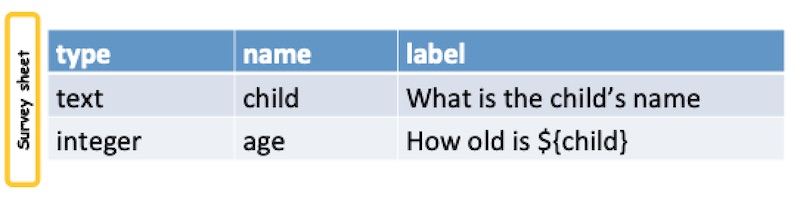

Referring to Questions
======================

.. contents::
 :local:  

To refer to another question::
  
  Surround the question name with ${...}

Here is an example where the label for a question refers to the answer to a previous question.  In this case the name of the 
child will be included in the question about age.

   
   Referring to an Answer

You can do this in choice labels as well as question labels.  Use if this feature is very common including for:

*  To provide contextual information as in the previous example
*  For **relevance** such as "Skip to question 5 if the age is less than 5"
*  For **contraints**, such as "The number of children attending school must be less than or equal to the number of children in the house"
*  In **calculations**, such as "if age is > 20 then status is adult"
