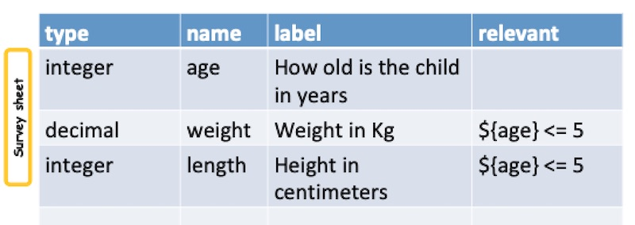
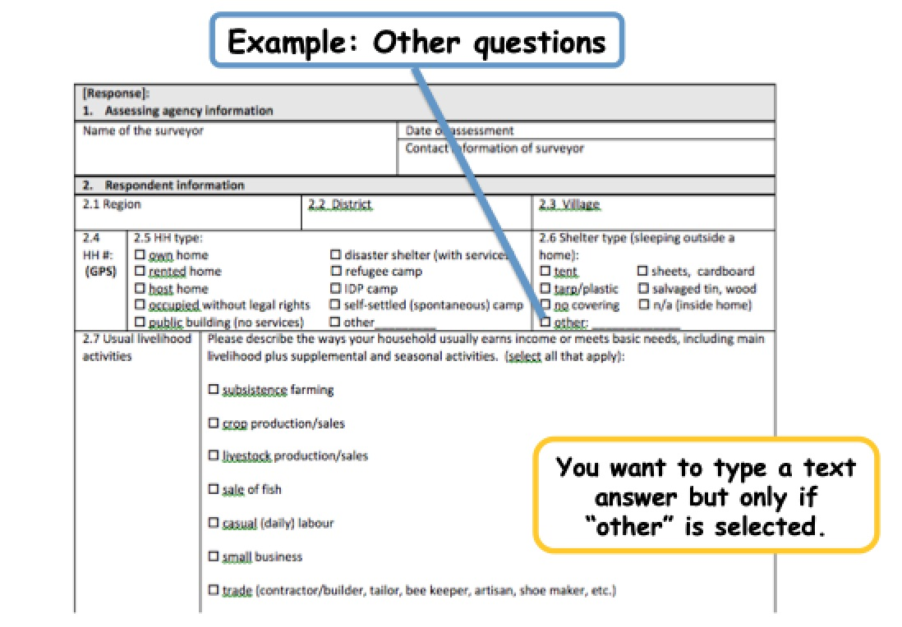
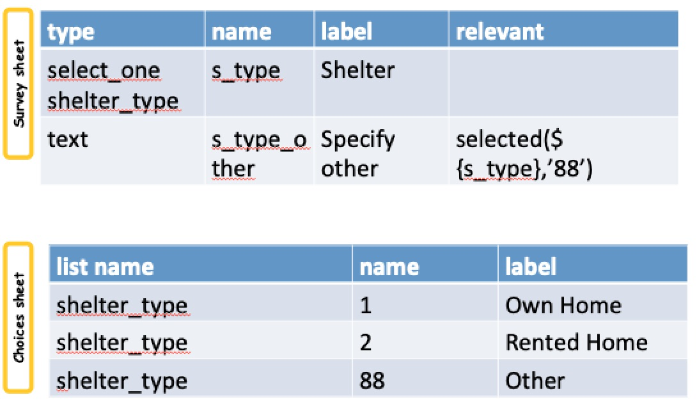

Relevance
=========

.. contents::
 :local:  

What is Relevance
-----------------
  
::
  
  In surveys we don't "skip to another question" instead we check to see if a 
  question is "relevant" before it is asked. 
  
  If the question is not relevant then it will not be asked hence it will have 
  been skipped.
  
  The rules that determine relevance of a question are specified in the column 
  labelled "relevant" in the survey worksheet.
  
In the following example the weight and length questions are only **relevant** if the age is less than or equal
to 5 years
  

   Example
   
If Selected
-----------

Often a question is relevant if a specific choice has been selected in a select question.  You can test for that using
the selected function::

  selected ( ${question_name},  'choice name' )
  
.. note::

  The single quotation marks around the choice name are required.  This is because the answer to select questions is always 
  a text value.  So even if your choice names have been specified as numbers; 1, 2, 3 the selected value will be considered text
  '1', '2', '3'. 

Actually sometimes you can just use **=** instead of selected().  If the select question you are referring to is of type **select_one** 
then you could have written the above::

  ${question_name} = 'choice name'
  
Using **=** will not work with **select_multiple**.  For this reason it is common to always use the selected() function for consistency
and to prevent problems that could happen if a select_one was changed to a select_multiple without updating relevance.
  
Other Questions
---------------

A very common usage of relevance is to show a text question asking the user to "Please specify"  what they meant by selecting **Other** in
a choice list.

   An Other Question

We can use fhe selected functions as shown below

   Relevance for other

More Complex Expressions
------------------------

Expressions can be built up using "and" and "or".  For example::

  ${age} < 10 and ${gender} = 'female'
  selected(${q}, 'choice1') or selected($q}, 'choice2')

For more information refer to :ref:`expression-reference`
