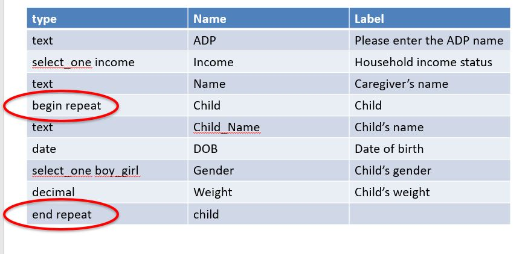

.. _xls-repeats:

Repeats
=======

.. contents::
 :local:

If you need to ask the same group of questions multiple times then you can use a **begin repeat** type question.  For example
you may want to ask the same questions about each member of the household.

Paper Form
----------

.. figure::  _images/repeats1.jpg
   :align:   center
   :width: 	 600px
   :alt:     Paper Version

   Paper version
   
Creating
--------

A **begin repeat** type question starts the repeating group and an **end repeat** finishes it.  Note that **begin repeat** has a
space in it.  All the questions between the **begin repeat** and **end repeat** will then be repeated.

   Repeating Group
   
The name of the **end repeat** type question is optional.  If you do specify then make sure it is the same as the name
for the **begin repeat**.

The label for the **begin repeat** is optional.  If specified it will appear at the top of the screen in FieldTask while the
user is in the repeating group.

Fixing the Number of Repeats
----------------------------

When completing a survey in FieldTask the user will be asked a question before they enter the repeating group::

  Do you want to add another [and then the label for the repeating group here]
  
  If they select yes then another repeat will be added.
  
However you can configure the survey so that it repeats automatically a specified number of times without asking that question.
For example you may already have asked how many people are in the household in a question called **hh_members**.  Put a reference
to that question in the **repeat_count** column in the row that has the **begin repeat** type::

  ${hh_members}
  
  Automatically repeat the number of times specified in the answer to hh_members.

Counting the repeats
--------------------

If you did not fix the number the repeats then you may want to find out how many there were. Use the count() function.

.. figure::  _images/repeats3.jpg
   :align:   center
   :width: 	 600px
   :alt:     Counting Repeats

   Counting Repeats
   
 
  

Alternatives
------------

You may decide that you want to "flatten" the repeating data and include it in your main form.  To do this you would need
to copy the question the maximum number of repeats.  For example a question about name could be set to repeat 3 times::

  What is the name of the first child?
  What is the name of the second child?
  What is the name of the third child?
  
Then you can use relevance so that if the household only has 1 child then only the first question would be shown.

