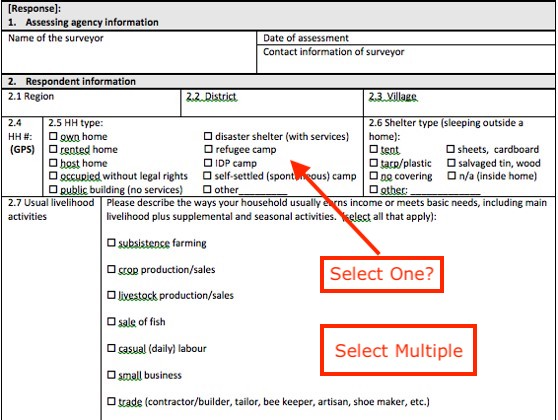

Select Questions
================

.. contents::
 :local:
 
Select questions have choices and you put these choices into the choices sheet then connect them to the question using a "list_name".

Types
-----

* select_one   			(The user can only select one of the choices)
* select_multiple       (The user can select multiple choices)

Select One or Select Multiple
-----------------------------

In the paper survey shown below, question 2.7 is clearly a select multiple question.  This is confirmed by the 
hint (select all that apply).  It is not so clear that question 2.4 is a Select One question, however presumably because there
is no hint telling the enumerator to select all that apply then only one should be selected.

   Which select to use?
   
One of the advantages of using phone based surveys is that the analyst has to explicitely set the type to select_one
or select multiple and it will not be left up to the enumerator.

Specifying
----------

   Specifying?

The question is linked to its list of choices through the list name.

.. note::

  The list name is not the same as the question name although often they can be set to the same value which can cause 
  confusion.   If a list of choices is only ever used by a single question then you may as well set the list name to
  the question name.   For example if you have a question called q1 and it has a list of choices unique to it then call the 
  list "q1" as well.  Its question 1's list of choices!
  
  However if more than one question uses the same list of choices then the list name should probably relate to 
  those choices.  A common example is yes or no questions.  Question 1 might ask "Are you married?".  An appropriate
  list name for the choices might then be "yes_no".
  
.. warning::

  There is a space between the question type and the list name but there can be no spaces in the list name or the 
  question name.

   
