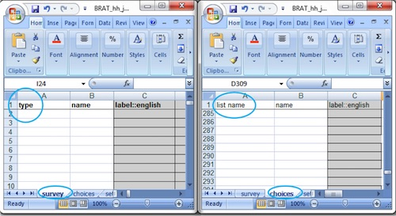

Simple Questions
================

Most questions only require an entry in the "survey" sheet.  

.. Note:: 

  The exceptions are the select questions and the rank question which also require choices to be specified.

To add a simple question you need to specify the question type, its name and its label.  The label being the text that is shown 
to the data collector.

Text Question
-------------

   Survey and Choices Worksheets
   
