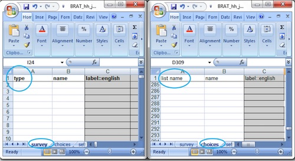

Template Worksheets
===================

.. contents::
 :local:
 
The XLS template has up to 5 worksheets.  However by far the most important are the first 2; survey and choices.  Most of the time these
are the only two worksheets that you will use. 

   Survey and Choices Worksheets

survey
------

The "survey" sheet is where you put the questions themselves. It allows you to specify the type of question. For example "select_one",
"select_multiple" or "integer". As well as constraints, skip rules and other question attributes.

choices
-------

The "choices" sheet, as indicated by its name, is where all the different choices for a select question are specified. So in a "select_one"
question the list out of which a single answer is selected will be specified in the choices sheet.

The big advantage of separating choice lists from the questions that use them is that many questions can then share the same list of choices. 
For example a choice list where the response can be "Yes" or "No".  You may have many questions that ask for a yes or no
response and they can all refer to the same choice list.  Another example is two questions that ask for problems encountered before
and after an emergency.  The list of choices may be long and to keep these consistent it is much easier to refer to a single choice list from both
questions.

However the choice lists for each question must be exactly the same.  If one question requires an extra choice then it will need its own 
choice list.

settings
--------

The "settings" sheet is where you put overall settings for your survey such as the default language that should be shown when the 
survey is opened on the mobile device.

styles
------

When viewing submitted data in the console you can highlight some answers with a background color.  You specify the answers and the 
colors they should be shown as in the "styles" sheet.

conditions
----------

You can add additional values to your survey that are calculated on the server and not entered by the user on the phone.  These
server calculations can consist of an "if" function that conditionally sets its value depending on the values of other questions. These 
conditions are specified in the "conditions" sheet.

